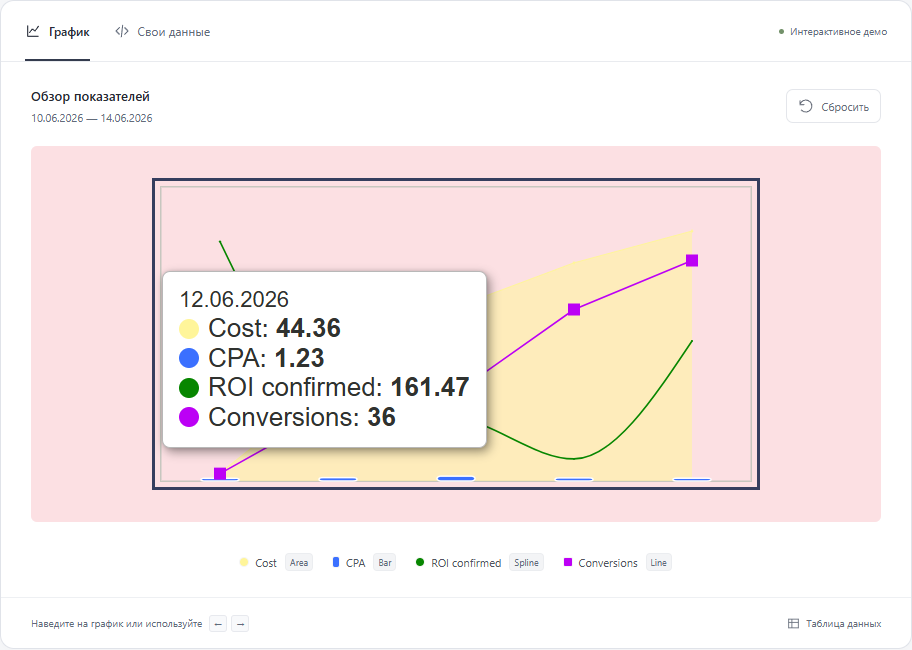

# AD ROBOT — Time Series

Интерактивный график по [референсу из задания](https://cleanshot.com/share/cBDRxJWM): четыре time-series, четыре способа отображения — **area, spline, line, bar**.

**[Открыть демо](https://Echi4ok.github.io/testovoe_AD_ROBOT/)** · [Исходный компонент](src/chart/TimeSeriesChart.tsx) · [Данные из GIF](src/data/reference.ts)



## Запуск

Нужен **Node.js 22.12+** (рекомендуется Node.js 24) и npm.

```bash
git clone https://github.com/Echi4ok/testovoe_AD_ROBOT.git
cd testovoe_AD_ROBOT
npm ci
npm run dev
```

Откройте адрес из терминала, по умолчанию `http://127.0.0.1:5173`.

```bash
npm run build     # Проверка TypeScript и production-сборка в dist/
npm run preview   # Локальный просмотр production-сборки
```

Сервер и ключи API не нужны. Данные обрабатываются в браузере. Приложение не использует внешние шрифты, аналитику или сетевые API.

## Инициализация четырьмя рядами

Компонент находится в `src/chart/`. Он независим от страницы демо и принимает один объект `series` с обязательными ключами `area`, `spline`, `line`, `bar`.

Полный минимальный пример для React:

```tsx
import { TimeSeriesChart, type ChartSeries } from './chart';

const series = {
  area: {
    name: 'Cost',
    data: [
      ['2026-06-10', 2.04],
      ['2026-06-11', 25.85],
      ['2026-06-12', 44.36],
    ],
    yDomain: [0, 75],
  },
  spline: {
    name: 'ROI confirmed',
    data: [
      ['2026-06-10', 610.78],
      ['2026-06-11', 180.5],
      ['2026-06-12', 161.47],
    ],
    yDomain: [0, 750],
  },
  line: {
    name: 'Conversions',
    data: [
      ['2026-06-10', 3],
      ['2026-06-11', 30],
      ['2026-06-12', 36],
    ],
    yDomain: [0, 120],
    decimals: 0,
  },
  bar: {
    name: 'CPA',
    data: [
      ['2026-06-10', 0.68],
      ['2026-06-11', 0.86],
      ['2026-06-12', 1.23],
    ],
    yDomain: [0, 75],
  },
} satisfies ChartSeries;

export function Example() {
  return (
    <div style={{ maxWidth: 592, background: '#fce0e3', padding: 20 }}>
      <TimeSeriesChart series={series} />
    </div>
  );
}
```

CSS подключается вместе с компонентом. Для переноса в другой React-проект скопируйте каталог `src/chart/` и установите `d3-shape` (для TypeScript также `@types/d3-shape`). `src/App.tsx` и стили страницы переносить не нужно.

### Формат данных

```ts
type DataPoint = readonly [time: string | number, value: number | null];

interface TimeSeries {
  name: string;
  data: readonly DataPoint[];
  color?: string; // HEX: #rgb, #rrggbb или #rrggbbaa
  yDomain?: readonly [min: number, max: number];
  decimals?: number; // 0–10; по умолчанию line: 0, остальные: 2
}
```

- Дата: `YYYY-MM-DD`, ISO datetime **с часовым поясом** или Unix timestamp **в миллисекундах**. Формат `12.06.2026` на входе намеренно не допускается. В подсказке дата отображается как `DD.MM.YYYY`, в UTC.
- Последовательности могут иметь разные даты и длины. Данные сортируются по времени, исходные массивы не изменяются. При повторении timestamp берётся последняя точка соответствующего ряда.
- `null` создаёт разрыв линии/заливки и отображается как `—`. Отсутствующая в ряду дата также даёт `—` в общей подсказке. Между существующими точками одного ряда линия соединяется; значения на чужие даты не интерполируются.
- Нулевые и отрицательные значения поддерживаются. Пустые массивы и полностью скрытые ряды имеют отдельные состояния.
- `yDomain` задаётся **для каждого ряда отдельно**. Если его не передать, масштаб вычисляется автоматически с включением нуля и запасом по высоте. Значения вне заданного диапазона обрезаются рамкой, но в подсказке остаются исходными.
- X — общая непрерывная шкала времени: двухдневный промежуток вдвое шире однодневного. Ряды совмещаются по timestamp, а не по индексу массива.

### Props

| Свойство             | Тип                                   | По умолчанию                  |
| -------------------- | ------------------------------------- | ----------------------------- |
| `series`             | `ChartSeries`                         | Обязательно: все четыре ключа |
| `hiddenSeries`       | `readonly SeriesType[]`               | `[]`                          |
| `height`             | `number`                              | `296` пикселей                |
| `ariaLabel`          | `string`                              | Названия исходных метрик      |
| `onActiveDateChange` | `(timestamp: number \| null) => void` | Не задан                      |

Ширина соответствует контейнеру и обновляется через `ResizeObserver`. `hiddenSeries` позволяет вынести легенду в свой интерфейс. Данные следует обновлять новым объектом `series`, как обычный immutable React state. `validateSeries(value)` доступен отдельно для валидации JSON до передачи компоненту.

## Что повторено из референса

Все значения за **10–14 июня 2026** прочитаны из пяти подсказок в GIF, включая `ROI confirmed: 180.50` и `CPA: 1.23`.

| Ряд           | Отображение                                            | Диапазон демо |
| ------------- | ------------------------------------------------------ | ------------- |
| Cost          | Светло-жёлтая полупрозрачная area с прямыми сегментами | 0–75          |
| CPA           | Низкие синие столбцы с белой обводкой                  | 0–75          |
| ROI confirmed | Тонкая зелёная spline; утолщается при наведении        | 0–750         |
| Conversions   | Фиолетовая line с квадратными маркерами                | 0–120         |

Также воспроизведены розовый фон, тонкая серая рамка, отсутствие подписей осей/сетки, белая подсказка с тенью, порядок строк **Cost → CPA → ROI confirmed → Conversions**, жирные значения и полупрозрачные ореолы у активных точек. Базовый размер области — **592 × 296 px**. Подсказка выбирает ближайшую дату, следует за указателем и меняет сторону у края.

В исходнике видны сильно отличающиеся вертикальные масштабы; их диапазоны восстановлены по координатам точек. Поэтому CPA в демо остаётся очень низкой. Для иных данных можно убрать `yDomain` или передать свои диапазоны. Высоты разных метрик здесь нельзя сравнивать напрямую.

Исходный код графика в задании не предоставлен: внешний вид восстановлен по анимации. Для spline используется монотонная кубическая интерполяция D3 (`curveMonotoneX`), сохраняющая форму между точками без выбросов; кривая и сглаживание шрифта могут немного отличаться от оригинального движка и macOS. Соседние ячейки таблицы и кнопка редактирования из GIF не относятся к компоненту графика.

## Поведение демо

- Наведение мышью показывает все доступные значения ближайшей даты. Попадание на линию подчёркивает её толщиной. Выход указателя закрывает подсказку.
- На сенсорном экране касание выбирает дату, подсказка остаётся после отпускания. Вертикальная прокрутка страницы сохраняется.
- `Tab` фокусирует график, `←` / `→` переключают даты, `Home` / `End` переходят к первой/последней, `Escape` закрывает подсказку. Значения объявляются через live region.
- Легенда скрывает и возвращает ряды, не меняя расположение дат и масштабы.
- «Таблица данных» показывает те же значения в доступной HTML-таблице.
- «Свои данные» позволяет применить JSON. Ошибка показывается рядом с редактором; рабочие данные сохраняются до корректного применения.
- «Сбросить» возвращает исходные пять точек и все четыре ряда.

## Проверки

```bash
npm run typecheck
npm test
npx playwright install chromium firefox
npm run test:e2e
npm run build
npm run format:check
```

На Linux для первого запуска Playwright: `npx playwright install --with-deps chromium firefox`.

`npm run check` запускает typecheck, unit-тесты, сборку и браузерные тесты одной командой. В GitHub Actions эти же проверки, плюс форматирование, выполняются при push и pull request.

- **Unit:** разбор дат, сортировка, дубликаты, неизменность входа, разные последовательности, `null`, отрицательные/нулевые значения, независимые шкалы, пропорции времени, геометрия и разрывы SVG.
- **Браузеры:** Chromium, Firefox и мобильная эмуляция Chromium: пять точных подсказок, мышь, touch, клавиатура, легенда, JSON, ошибки, пустые данные, таблица, размещение подсказки и отсутствие JS-ошибок.
- **Доступность:** автоматическая проверка axe для графика и редактора. Цвета самих линий сохранены из референса; дополнительно есть разные формы, текстовая легенда, подсказка и таблица. Автоматический аудит не заменяет проверку с реальным скринридером.

Физический iPhone/Safari и большие объёмы данных не проверялись. Компонент рассчитан на компактные интерактивные графики; для сотен тысяч точек понадобится агрегация/downsampling или Canvas.

## Структура

```text
src/
  chart/              # Публичный компонент, типы, геометрия, валидация и CSS
  components/         # Редактор JSON, таблица и иконки страницы демо
  data/reference.ts   # Пять точек из анимации
  App.tsx             # Демонстрационная страница и её состояние
tests/                # Playwright + axe
.github/workflows/    # Автоматические проверки
```

React отвечает за интерфейс и состояние, TypeScript — за контракт данных. SVG позволяет точно настроить заливку, маркеры и hover. Из D3 взят только `d3-shape` для генерации путей; готовые chart-библиотеки и платные лицензии не нужны. Страница собирается через [Vite](https://vite.dev/guide/); интерполяция описана в [документации D3](https://d3js.org/d3-shape/curve#curveMonotoneX).
